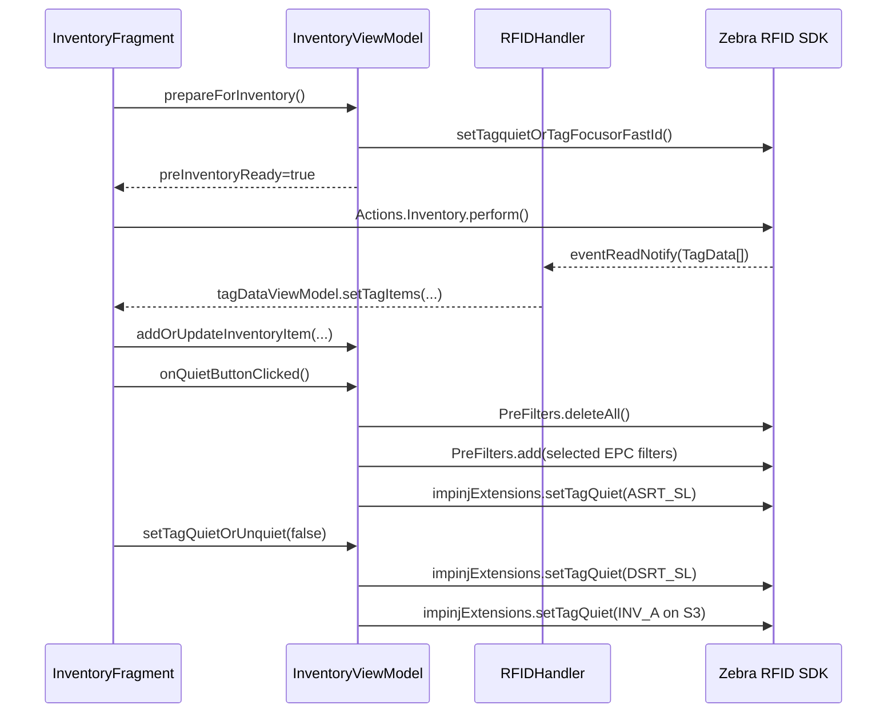

# Design: Zebra RFID + Impinj Gen2X Android Sample App

## Scope
This document explains how the app works internally and provides detailed code snippets for:
- Reader initialization and connection.
- Inventory data flow.
- Tag quiet timer behavior.
- Quiet and unquiet operations.
- Recommended refactor for reliability.

Source references used in this design:
- `ZebraGen2X_AppUserGuide.pptx`
- `app/src/main/java/com/example/newgen2xplay/...`

## Architecture Overview
- MainActivity owns a single RFIDHandler instance and global TagDataViewModel.
- RFIDHandler owns Zebra SDK objects:
  - Readers
  - RFIDReader
  - ImpinjExtensions
- ConnectFragment drives reader discovery and connection.
- InventoryFragment orchestrates UI interactions and timers.
- InventoryViewModel performs RFID operations and maintains inventory state.

## User Guide To Code Mapping
The PPTX user guide sections map to implementation as follows:

| Guide Section | Code Location |
|---|---|
| Connect | `ui/connect/ConnectFragment.java`, `ui/connect/ConnectViewModel.java`, `RFIDHandler.java` |
| Inventory (timer, summary, unique tags) | `ui/Inventory/InventoryFragment.java`, `ui/Inventory/InventoryAdapter.java` |
| Singulation | `ui/Singulation/SingulationFragment.java`, `ui/Singulation/SingulationViewModel.java`, `InventoryViewModel.setSingulation(...)` |
| Prefilter | `ui/Filters/PreFiltersFragment.java`, `ui/Filters/PreFiltersViewModel.java`, `InventoryViewModel.setPrefilterForQuietingTags(...)` |
| TagFocus | `InventoryViewModel.setTagFocus(...)` and Focus checkbox handlers |
| Tag Quieting / Unquiet | `InventoryViewModel.setTagQuietOrUnquiet(...)`, `InventoryFragment.quietRunnable` |
| Custom Tag Quieting | `ui/customImpinj/TagQuietCustomFragment.java`, `ui/customImpinj/TagQuietCustomViewModel.java` |
| Protected Mode | `ui/customImpinj/TagProtectFragment.java`, `ui/customImpinj/TagProtectViewModel.java` |
| FastID | `InventoryViewModel.setFastId(...)` and FastID checkbox handlers |

## Sequence Diagram


## Detailed Flow With Snippets

### 1) SDK initialization and reader transport
```java
// RFIDHandler.InitSDK()
if (readers == null) {
    readers = new Readers(context, ENUM_TRANSPORT.ALL);
    readers.setTransport(ENUM_TRANSPORT.ALL);
    isInitialized.postValue(true);
}
```

### 2) Reader configuration after connect
```java
// RFIDHandler.ConfigureReader()
mConnectedRfidReader.Events.addEventsListener(eventHandler);
mConnectedRfidReader.Events.setHandheldEvent(true);
mConnectedRfidReader.Events.setTagReadEvent(true);
mConnectedRfidReader.Events.setReaderDisconnectEvent(true);

Antennas.SingulationControl sc = new Antennas.SingulationControl();
sc.setSession(SESSION.SESSION_S0);
sc.Action.setInventoryState(INVENTORY_STATE.INVENTORY_STATE_AB_FLIP);
sc.Action.setSLFlag(SL_FLAG.SL_ALL);
mConnectedRfidReader.Config.Antennas.setSingulationControl(1, sc);

mConnectedRfidReader.Config.setTriggerMode(ENUM_TRIGGER_MODE.RFID_MODE, false);
mConnectedRfidReader.Actions.PreFilters.deleteAll();
```

### 3) Trigger press and release propagation
```java
// RFIDHandler.eventStatusNotify(...)
if (pressed) {
    triggerPressedLiveData.postValue(true);
} else {
    triggerPressedLiveData.postValue(false);
}
```

```java
// InventoryFragment observer
handler.triggerPressedLiveData.observe(getViewLifecycleOwner(), pressed -> {
    if (Boolean.TRUE.equals(pressed)) {
        inventoryViewModel.prepareForInventory();
    } else {
        stopInventoryProcess();
    }
});
```

### 4) Tag read ingestion and aggregation
```java
// InventoryViewModel.addOrUpdateInventoryItem(...)
for (InventoryItem existing : list) {
    if (existing.getEPC().equals(item.getEPC())) {
        existing.setCount(existing.getCount() + item.getCount());
        existing.setRSSI(item.getRSSI());
        existing.setLastSeenTimestampMillis(System.currentTimeMillis());
        found = true;
        break;
    }
}
if (!found) {
    item.setFirstSeenTimestampMillis(System.currentTimeMillis());
    list.add(item);
}
inventoryItems.setValue(new ArrayList<>(list));
```

### 5) Quiet timer mechanism
Current behavior parses quietTimer input in each runnable execution.

```java
// InventoryFragment.quietRunnable
String quietTimer = binding.quietTimer.getText().toString();
int quietTimeInMilliSeconds = 2000;
if (!quietTimer.isEmpty()) {
    int seconds = Integer.parseInt(quietTimer);
    if (seconds > 0) {
        quietTimeInMilliSeconds = seconds * 1000;
    }
}
quietHandler.postDelayed(this, quietTimeInMilliSeconds);
```

Recommended: parse once into a config object when starting the loop.

```java
private static int parseQuietIntervalMs(String value) {
    int seconds = 2;
    try {
        if (value != null && !value.trim().isEmpty()) {
            seconds = Integer.parseInt(value.trim());
        }
    } catch (NumberFormatException ignored) {}
    seconds = Math.max(1, Math.min(seconds, 600));
    return seconds * 1000;
}
```

### 6) Quiet operation details
```java
// InventoryViewModel.onQuietButtonClicked()
mConnectedRfidReader.Actions.PreFilters.deleteAll();
setPrefilterForQuietingTags(items);
setTagQuietOrUnquiet(true);
```

```java
// InventoryViewModel.setPrefilterForQuietingTags(...)
preFilter.setBitOffset(32);
preFilter.setTagPatternBitCount(96);
preFilter.setTagPattern(item.getEPC());
preFilter.setMemoryBank(MEMORY_BANK.MEMORY_BANK_EPC);
preFilter.setFilterAction(FILTER_ACTION.FILTER_ACTION_STATE_AWARE);
preFilter.StateAwareAction.setTarget(TARGET.TARGET_INVENTORIED_STATE_S3);
preFilter.StateAwareAction.setStateAwareAction(STATE_AWARE_ACTION.STATE_AWARE_ACTION_INV_B);
```

```java
// InventoryViewModel.setTagQuietOrUnquiet(true)
impinjExtensions.setTagQuiet(
    new ENUM_TAGQUIET_MASK[]{ENUM_TAGQUIET_MASK.S3B},
    TARGET.TARGET_SL,
    STATE_AWARE_ACTION.STATE_AWARE_ACTION_ASRT_SL,
    (short) 1
);
```

### 7) Unquiet operation details
```java
// InventoryViewModel.setTagQuietOrUnquiet(false)
impinjExtensions.setTagQuiet(mask, TARGET.TARGET_SL, STATE_AWARE_ACTION.STATE_AWARE_ACTION_DSRT_SL, (short) 1);
impinjExtensions.setTagQuiet(mask, TARGET.TARGET_INVENTORIED_STATE_S3, STATE_AWARE_ACTION.STATE_AWARE_ACTION_INV_A, (short) 1);
```

## Code Review Findings (Severity Ordered)

### High
1. prepareForInventory posts success after catch path.
- File: app/src/main/java/com/example/newgen2xplay/ui/Inventory/InventoryViewModel.java
- Risk: inventory can start with failed pre-inventory setup.

2. onQuietButtonClicked runs Thread.sleep in UI-triggered path.
- File: app/src/main/java/com/example/newgen2xplay/ui/Inventory/InventoryViewModel.java
- Risk: UI stutter and ANR risk under load.

### Medium
3. quiet mode variable is read but main quiet branch in setTagquietOrTagFocusorFastId is commented.
- File: app/src/main/java/com/example/newgen2xplay/ui/Inventory/InventoryViewModel.java
- Risk: mismatch between checkbox state and behavior.

4. adapter initialized twice in InventoryFragment.
- File: app/src/main/java/com/example/newgen2xplay/ui/Inventory/InventoryFragment.java
- Risk: redundant object creation and future maintenance confusion.

### Low
5. removeResult LiveData in TagQuietCustomViewModel is declared but not set by any operation.
- File: app/src/main/java/com/example/newgen2xplay/ui/customImpinj/TagQuietCustomViewModel.java

## Recommended Refactor Plan
1. Introduce explicit ViewModel methods: applyQuietToSelectedTags and applyUnquiet.
2. Keep all RFID commands in executor-backed background threads.
3. Parse quiet timer once at loop start and clamp bounds.
4. Post preInventoryReady true only on success path.
5. Remove duplicate adapter initialization and dead LiveData.

## Validation Checklist
- Reader connect/disconnect works across repeated sessions.
- Trigger press starts inventory and release stops inventory.
- Quiet timer defaults to 2s on empty/invalid input.
- Quiet operation only applies to selected EPC filters.
- Unquiet restores visibility of previously quieted tags.
- Stopping inventory cancels timer and quiet runnables.
